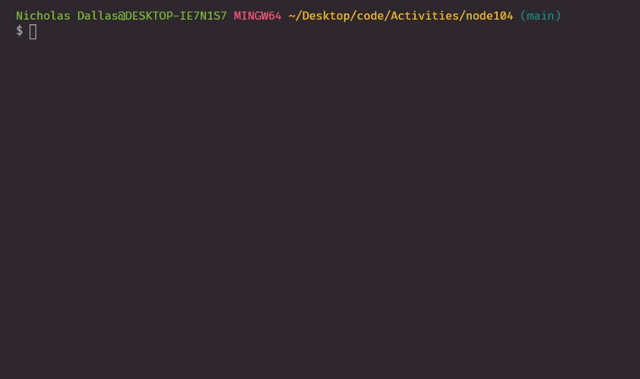

# node104
Node104 is all about fine tuning our AJAX server-side skills and practicing object oriented programming. We give one example of a simple writeFile and how to render it in an HTML document. In addition we also go over Constructors and how to better organize our code with Constructors. 

## writeFile to an HTML document

> In addition to being able to create a .txt file, we can also make an HTML doc with the writeFile method. 

## AXIOS Request to SWAPI

>

## Reference Section 
- [Corse-anywhere](https://github.com/aydinsenih/cors-anywhere)
- [SWAPI](https://swapi.dev/documentation#javascript)

## LINKS

- [GitHub Repo Link](https://github.com/nicholasd-uci/node104)
- [Nicholas Dallas's GitHub](https://github.com/nicholasd-uci)

- - -
© 2020 NPRD, Nicholas Paul Ruiz Dallas